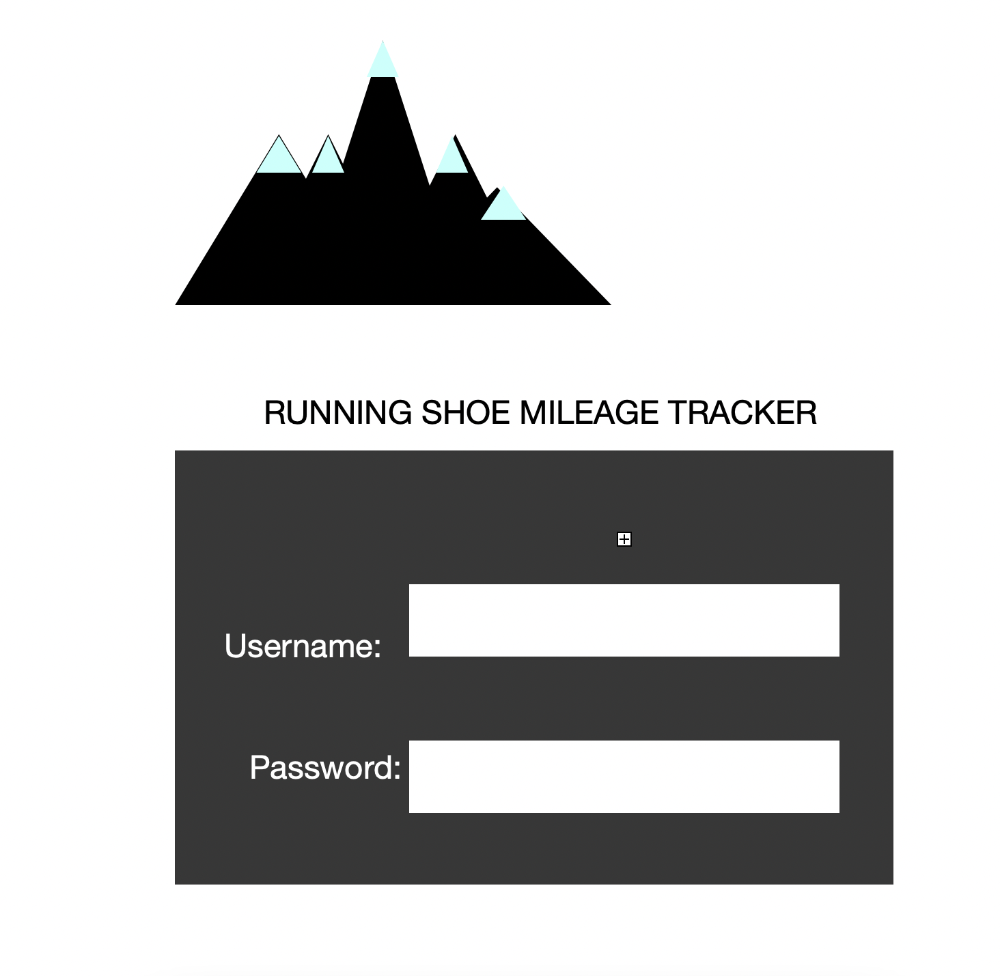

# startup
My idea is to have a website where someone can login and enter how many miles they ran and what shoe they used. The database will store how many miles are on each shoe so the person is aware of when to get new shoes. I am on the BYU cross country team and we run up to 100 miles a week, and shoes can generally handle 300 to 400 miles so it can be helpful to know how many miles are on each shoe so the person can be aware of when to retire the shoes and get new ones.
 
I will have a username login section.
Database data: it will save the amount of miles each shoe has 
WebSocket data: still deciding, but will prbably show who has run the most miles so far. 

